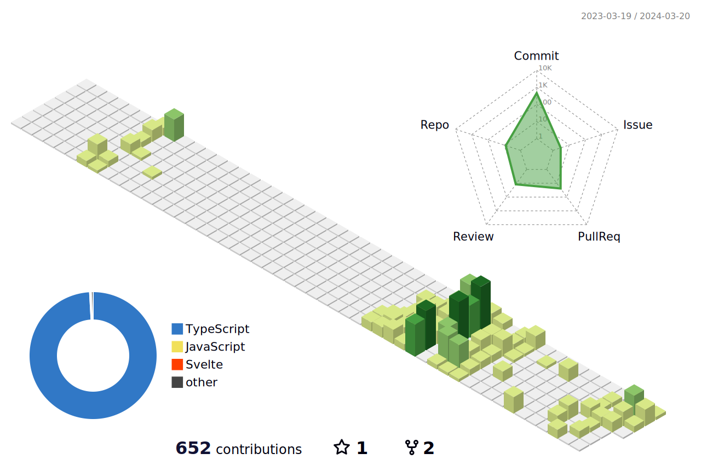

<h3 align="center">Social</h3>

<h3 align="center">Technologies & Tools 🛠️</h3>

    

<h3 align="center">Todoist Stats</h3>

<!-- TODO-IST:START -->
🏆  3,570 Karma Points           
🌸  Completed 2 tasks today           
✅  Completed 121 tasks so far           
⏳  Longest streak is 2 days
<!-- TODO-IST:END -->

<h3 align="center">Contribution Stats</h3>

